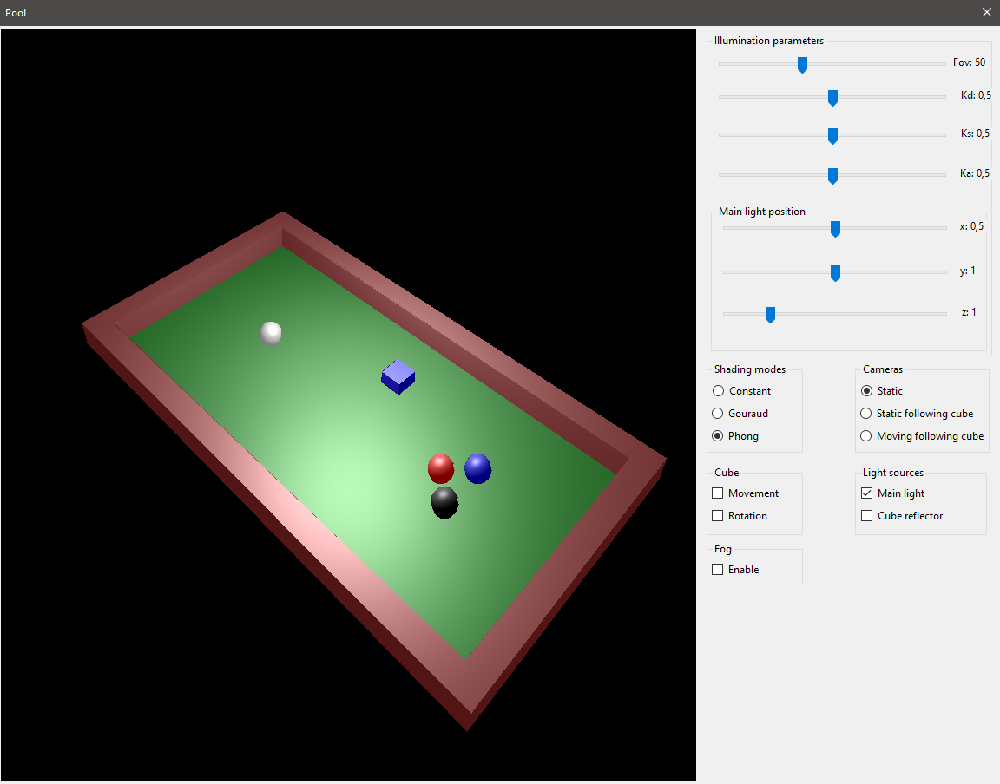

# Pool graphical app

An application written in C# using Windows Forms with .NET Core simulating a simple pool table in 3D. Multiple cameras and shading models are implemented, as well as a possibility to enable rotations and movement of the blue cube.

